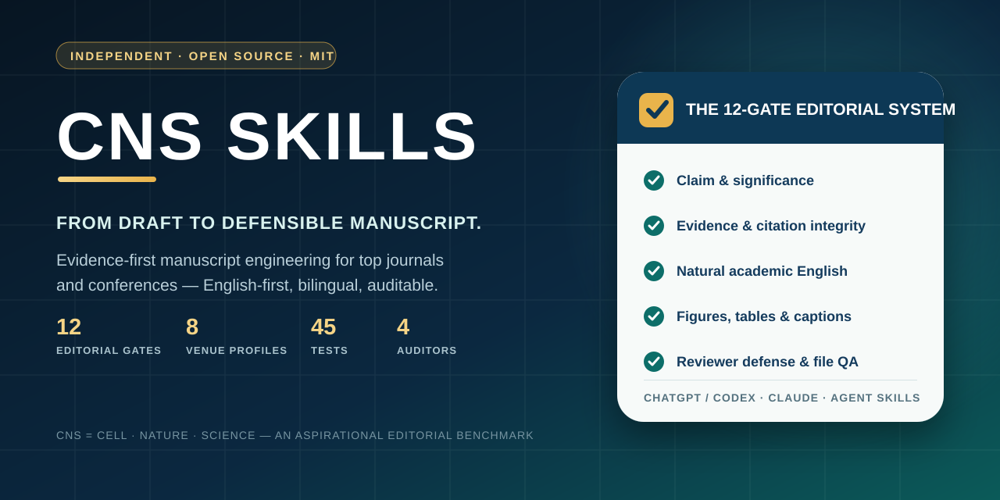

<p align="center">
  
</p>

<div align="center">

## Make every claim earn its place.

**Evidence-first manuscript engineering for top journals and conferences.**

CNS Skills turns English or Chinese drafts into clearer, more defensible submission manuscripts—then audits the claims, citations, figures, tables, reviewer logic, and final file that sentence-level polishing can leave behind.

[**Quick install**](#quick-install) · [**Run the flagship workflow**](#run-the-flagship-workflow) · [**See the proof**](#proof-not-hype) · [**Cite CNS Skills**](#cite-cns-skills) · [简体中文](README.zh-CN.md)

[](https://github.com/niuyupeng/CNS-Skills/releases)
[](https://github.com/niuyupeng/CNS-Skills/actions/workflows/ci.yml)
[](LICENSE)
[](https://agentskills.io/)
[](CITATION.cff)

**12 editorial gates · 8 venue profiles · 320-abstract auditable baseline · 64 routing cases · 60 deterministic tests · 4 transparent auditors**

<sub>Independent MIT-licensed project. CNS means Cell · Nature · Science as an aspirational editorial benchmark; it does not imply affiliation, endorsement, or acceptance.</sub>

</div>

---

## What CNS Skills is

Sentence-level polishing is only one layer. **CNS Skills engineers the manuscript without outrunning the science.**

It starts by locking the source, claims, numbers, terminology, and evidence boundary. It then repairs the argument, reconstructs submission English, audits claim–citation fit, pressure-tests the paper through skeptical readers, strengthens the figure story, and—when the host provides document rendering—verifies the rendered DOCX or PDF.

The result is not generic “AI-sounding academic prose.” It is a manuscript whose contribution is easier to see, whose claims are easier to defend, and whose unresolved risks are harder to hide.

| Where sentence-level polishing stops | Where CNS Skills continues |
|---|---|
| smoother sentences | central claim, significance, novelty, and paragraph logic |
| literal Chinese-to-English translation | claim-first English reconstruction plus bilingual back-audit |
| reference formatting | DOI/status, entailment, scope, placement, and independence checks |
| attractive figures | visual claim, provenance, uncertainty, caption, accessibility, and final-size QA |
| a clean-looking file | invariant checks, cross-references, tables, comments, tracked changes, and page rendering |
| “sounds publishable” | explicit reviewer risks, missing evidence, and venue-fit limits |

> **The rule:** evidence integrity > meaning preservation > logic > authorial voice > elegance.

### One evidence-boundary example

This synthetic example shows the difference between surface polishing and evidence-bounded revision:

| Supplied evidence | Original sentence | CNS audit | Evidence-bounded revision |
|---|---|---|---|
| one *in vitro* experiment | “This platform enables clinical translation.” | the clinical claim exceeds the reported validation | “The platform improved X *in vitro*; *in vivo* performance and clinical utility remain untested.” |

One request can return a **revised manuscript · decision/risk map · citation audit · figure/table QA · rendered-file check when the host supports document rendering**.

## Run the flagship workflow

Attach a manuscript and ask naturally. For the full workflow:

```text
Use $cns-skills in English-final + CNS/top-venue mode to revise this manuscript.
Preserve every supported scientific claim, number, citation, and project-defined scale.
Rebuild the argument in field-native submission English rather than translating line by line.
Audit overclaiming, DOI/status, claim–citation alignment, figures, tables, captions, and cross-references.
Read as a domain expert, methods reviewer, editor, and adjacent-field reader.
Return the revised file, a concise decision/risk log, and verify every rendered page.
```

Other high-value requests:

- “Turn this Chinese SCI draft into natural submission English without changing the science.”
- “Review this paper like a demanding Nature or CVPR reviewer.”
- “Strengthen the abstract, introduction, and discussion around one defensible central claim.”
- “Audit every consequential claim against its citation and identify overclaiming.”
- “Expand this review from argument gaps, not from a target reference count.”
- “Design or audit the paper’s figures, evidence tables, captions, and graphical abstract.”
- “Prepare an evidence-faithful rebuttal and response-to-reviewers letter.”

When implicit selection is enabled, no special syntax is required. The public [routing evaluation](evals/README.md) includes manuscript tasks and close non-target requests so CNS does not hijack generic translation, identifier lookup, reference-style conversion, central-nervous-system questions, or AI-detector evasion.

## Quick install

### ChatGPT desktop / Codex plugin

```bash
codex plugin marketplace add niuyupeng/CNS-Skills
```

Restart the ChatGPT desktop app, open the Plugins Directory, select the **CNS Skills** source, and install **CNS Skills**. The repository package supports local and repository distribution; listing in a shared global directory remains subject to platform review.

### Claude Code plugin

```bash
claude plugin marketplace add niuyupeng/CNS-Skills
claude plugin install cns-skills@cns-skills
```

Claude can select the skill from the task. Explicit invocation is `/cns-skills:cns-skills`.

### Standalone Agent Skill

```bash
# ChatGPT desktop / Codex
git clone https://github.com/niuyupeng/CNS-Skills.git ~/.agents/skills/cns-skills

# Claude Code
git clone https://github.com/niuyupeng/CNS-Skills.git ~/.claude/skills/cns-skills
```

Every release includes a platform-uploadable ZIP and a SHA-256 checksum. The root skill and generated plugin payload are checked for drift in CI.

## Proof, not hype

Every number below is inspectable in this repository.

| Public verification asset | What it establishes | What it does **not** establish |
|---|---|---|
| [12-gate editorial standard](references/cns-editorial-standard.md) | a documented 12-dimension selective-venue review surface | acceptance by any journal or conference |
| [8 venue profiles](references/venue-profiles.md) | distinct journal/conference review paths | permanent substitution for current official policies |
| [320-abstract aggregate baseline](references/venue-corpus-findings.md) | reproducible descriptive venue-language checks | a style-transfer corpus or acceptance model |
| [64 bilingual routing cases](evals/README.md) | positive and negative discovery regression coverage | guaranteed activation in every agent host |
| 30-case locked held-out split | resistance to metadata overfitting | an external benchmark leaderboard |
| [60 deterministic tests](tests) | observable invariants and CLI behavior | semantic proof that every edit is correct |
| 4 dependency-free auditors | transparent, local manuscript diagnostics | source-reading or author judgment |
| source/plugin synchronization in CI | packaged payload matches the root skill | endorsement by OpenAI, Anthropic, or a publisher |

The project deliberately refuses unverifiable marketing claims. There is no fabricated “success rate,” user count, citation count, acceptance rate, or detector-evasion score.

## The CNS Editorial Gate

The `CNS/top-venue` mode tests a manuscript across twelve connected gates:

1. central claim;
2. broad significance;
3. novelty and prior-art boundary;
4. evidence chain;
5. alternative explanations;
6. robustness and generalization;
7. narrative architecture;
8. figure and table story;
9. accessibility across fields;
10. reproducibility and reporting;
11. scientific integrity;
12. exact venue fit.

Cell, Nature, Science, AAAI, CVPR, NeurIPS, ICML, and ICLR have separate profiles. Current official author instructions remain authoritative.

```text
source lock → claim ledger → argument architecture → paragraph function
            → natural academic English → six-axis citation audit
            → visual evidence → skeptical readers → rendered-file QA
```

Five operating modes keep the depth proportional to the task: `audit`, `revise`, `deep-review`, `journal-ready`, and `CNS/top-venue`.

## Transparent manuscript auditors

The CLI requires Python 3.9+ and no third-party packages.

```bash
python scripts/cns_audit.py manuscript.docx --strict-clean-copy
python scripts/cns_audit.py manuscript.docx --verify-dois --shareable --json cns-report.json
python scripts/review_citation_audit.py review.docx --shareable --json review-citations.json
python scripts/check_invariants.py source.docx revision.docx --shareable --json invariants.json
python scripts/check_crossrefs.py revision.docx --shareable --json crossrefs.json
```

They report risky claim language, DOI status, formulaic/editorial-scaffolding patterns, bracketed numeric-reference structure, changed numbers/units/statistics/citations, broken figure/table references, and reader-visible clean-copy defects. The strict clean-copy gate also checks repeated 1×1 callouts, author-side production notes, caption styles, table-font drift, and tool/version leakage in DOCX filenames or metadata. They do not edit the manuscript, determine entailment by themselves, prove translation equivalence, or act as AI detectors. Non-shareable JSON can contain local paths and unpublished excerpts; use `--shareable` before external distribution.

The full operating contract is [SKILL.md](SKILL.md). Focused references cover [English-first bilingual writing](references/english-first-bilingual.md), [review articles](references/review-article-mode.md), [iterative review development](references/iterative-review-development.md), [figures and tables](references/figures-tables.md), [scientific integrity](references/scientific-integrity.md), and [venue profiles](references/venue-profiles.md).

## Cite CNS Skills

If CNS Skills strengthens a manuscript, review, rebuttal, or research-writing workflow, please **star the repository and cite the software**. Those two signals help other researchers find a rigor-first alternative to generic paper “humanizers.”

GitHub exposes **Cite this repository** from the root [CITATION.cff](CITATION.cff). A copyable BibTeX entry is also provided here:

```bibtex
@software{niu_cns_skills_2026,
  author  = {Niu, Yupeng},
  title   = {CNS Skills: Evidence-First Scientific Manuscript Revision and Quality Assurance},
  year    = {2026},
  version = {0.7.0},
  url     = {https://github.com/niuyupeng/CNS-Skills}
}
```

**[Star CNS Skills](https://github.com/niuyupeng/CNS-Skills)** · **[Open the citation file](CITATION.cff)** · **[Download the latest release](https://github.com/niuyupeng/CNS-Skills/releases/latest)**

## Community

The fastest path to a stronger public scientific-writing skill is inspectable criticism.

- Share a workflow or ask a design question in [Discussions](https://github.com/niuyupeng/CNS-Skills/discussions).
- Report a reproducible defect or propose a capability in [Issues](https://github.com/niuyupeng/CNS-Skills/issues).
- Contribute a test, venue correction, language pattern, or privacy-safe benchmark through [CONTRIBUTING.md](CONTRIBUTING.md).
- See the public [roadmap and changelog](CHANGELOG.md) before proposing overlapping work.

<details>
<summary><strong>Design lineage, licensing, and non-copying boundary</strong></summary>

CNS learns reusable principles from inspectable open projects without copying their prose or implementation. The [Agent Skills specification](https://github.com/agentskills/agentskills), [OpenAI Plugins](https://github.com/openai/plugins), and [Anthropic Skills](https://github.com/anthropics/skills) inform packaging and progressive disclosure. [Scientific Agent Skills](https://github.com/K-Dense-AI/scientific-agent-skills), [PaperQA2](https://github.com/Future-House/paper-qa), [OpenScholar](https://github.com/AkariAsai/OpenScholar), [ScholarQABench](https://github.com/AkariAsai/ScholarQABench), and [`ai-peer-review`](https://github.com/poldrack/ai-peer-review) inform auditable scientific workflows, grounded synthesis, and independent-reader evaluation. The open [MQM framework](https://www.themqm.org/) informs typed bilingual-error review.

The [open-source review](research/open-source-skill-review.md) records per-project lessons and license boundaries. Publicly visible is not synonymous with open source: no proprietary phrasebank, publisher text, or source-available document-skill content is copied.

</details>

## Name, affiliation, and limits

“CNS” means **Cell, Nature, and Science** as an aspirational benchmark for clarity, significance, evidence, and cross-disciplinary communication. CNS Skills is independent and is not affiliated with or endorsed by those journals, their publishers, any conference, OpenAI, Anthropic, or the referenced projects.

It does not fabricate evidence, invent references, disguise unsupported claims, guarantee editorial triage or acceptance, or optimize for AI-detector evasion. When the science does not support the intended story, CNS narrows the claim and identifies what evidence or analysis is still missing.

## License

[MIT](LICENSE) © 2026 Yupeng Niu.
