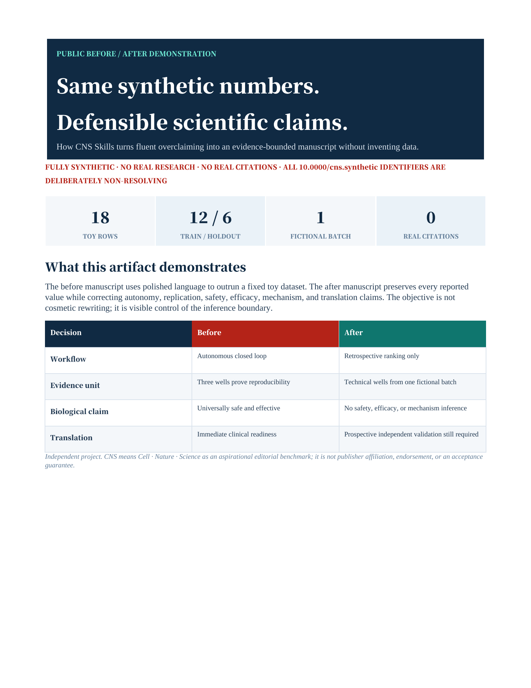

# Synthetic manuscript before/after demo

> **Fully synthetic. No real research, participants, animals, materials, experiments, citations, or resolvable DOIs appear anywhere in this example.** Every value is generated by a deterministic toy formula. Identifiers beginning `10.0000/cns.synthetic...` are visibly labeled, deliberately non-resolving placeholders and must never be cited as publications.

This fixture shows what CNS Skills is designed to change: not merely smoother sentences, but claims whose strength matches their evidence, citations whose role is explicit, display items that are cross-referenced, and a reader-visible manuscript with editorial debris removed.

[](CNS-Skills-synthetic-manuscript-demo.pdf)

**[Open the six-page PDF preview](CNS-Skills-synthetic-manuscript-demo.pdf)** · **[Download the editable DOCX](CNS-Skills-synthetic-manuscript-demo.docx)**

## What is included

| File | Purpose |
|---|---|
| `input_manuscript.md` | Intentionally flawed source for the “before” page of the DOCX demo |
| `revised_manuscript.md` | Evidence-calibrated source for the “after” page of the DOCX demo |
| `CNS-Skills-synthetic-manuscript-demo.docx` | Privacy-scrubbed, editable six-page before/after artifact |
| `CNS-Skills-synthetic-manuscript-demo.pdf` | Browser-friendly render inspected page by page |
| `demo-preview.png` | Rendered first page used as the public preview |
| `build_demo_docx.py` | Reproducible DOCX builder; requires `python-docx` |
| `synthetic_data.csv` | Frozen 18-row toy dataset; no measured or personal data |
| `reproduce_demo.py` | Standard-library-only generator and retrospective ridge ranking |
| `figure-1.svg` / `figure-1.png` | Editable accessible source and DOCX-ready render |
| `reports/claim-citation-risk-report.json` | Claim, citation-role, placeholder-DOI, and entailment decisions |
| `reports/overclaim-risk-report.json` | High-risk language and validation-layer corrections |
| `reports/cross-reference-risk-report.json` | Figure/table label comparison before and after |
| `reports/clean-copy-risk-report.json` | Reader-visible production leakage comparison |
| `storyboard-75s.md` | 75-second launch video or GIF script |

The Markdown files remain the authoritative manuscript text. The committed DOCX was built from those sources, scrubbed of production metadata, rendered with the standard document workflow, and inspected across all six pages. The PDF and preview PNG are derived from that inspected render.

## What the revision demonstrates

The input turns six familiar manuscript failures into visible test cases:

1. retrospective ranking is called an autonomous closed loop;
2. synthetic technical-well means are inflated into safety, efficacy, and clinical-readiness claims;
3. an in vitro proxy is said to cause wound healing;
4. citation 3 is missing, citation 2 is unused, and two references duplicate one placeholder DOI;
5. the text cites Figure 2 while only Figure 1 exists, and both existing captions are orphaned;
6. a TODO, editor assessment, author query, and output-version heading leak into reader-visible prose.

The revision keeps the same synthetic values but changes what can be inferred from them. It identifies one fictional batch and three technical wells, separates predicted from frozen outcomes, withholds inferential statistics, classifies the workflow as retrospective, and states the next validation design without predicting its result.

## Reproduce the frozen fixture

From the repository root:

```powershell
python examples/synthetic-hydrogel-demo/reproduce_demo.py --check
```

Expected first and last lines:

```text
PASS: synthetic_data.csv matches the deterministic generator (18 rows)
No prospective experiment was selected or run.
```

The script uses no random numbers and no external packages. It fits two ridge regressions to 12 training rows and ranks six held-out rows using a toy predicted-viability threshold. This is a reproducibility check for the software fixture, not validation of a scientific model.

## Re-run the lightweight audits

```powershell
python scripts/cns_audit.py examples/synthetic-hydrogel-demo/input_manuscript.md
python scripts/cns_audit.py examples/synthetic-hydrogel-demo/revised_manuscript.md --strict-clean-copy
python scripts/check_crossrefs.py examples/synthetic-hydrogel-demo/input_manuscript.md
python scripts/check_crossrefs.py examples/synthetic-hydrogel-demo/revised_manuscript.md --strict
python scripts/review_citation_audit.py examples/synthetic-hydrogel-demo/revised_manuscript.md
```

Expected transition:

| Check | Before | After |
|---|---|---|
| Clean-copy gate | FAIL; 4 reader-visible defects | PASS; 0 defects |
| Figure/table cross-references | 3 issues | clean |
| Numeric citation structure | missing entry 3, uncited entry 2, duplicate placeholder DOI | 3/3 cited; no missing, uncited, or duplicate entry |
| Overclaim triage | 7 high-risk sentences | 2 contextual matches, both human-reviewed as a negated boundary or substring false positive |

Automated citation structure does not prove entailment, and a clean cross-reference check does not prove that a DOCX rendered correctly. The JSON reports therefore include explicit human-review decisions and remaining limitations.

## DOCX and visual handoff

- Use `input_manuscript.md` and `revised_manuscript.md` as the before/after body text.
- Treat `figure-1.svg` as the editable source; embed the matching `figure-1.png` in DOCX and retain its caption.
- Underlying figure data: `synthetic_data.csv`.
- Shape encoding supplements color: blue circles are predictions; orange squares are frozen synthetic outcomes.
- No uncertainty is drawn because independent replicate data do not exist.
- The combined before/after artifact intentionally contains the flawed source page, so whole-file clean-copy triage is expected to flag that page. The clean-copy PASS applies to `revised_manuscript.md`, not to deletion of the public “before” evidence.
- The final DOCX contains no comments or tracked changes. Privacy scrubbing removed revision-session identifiers and core-property production metadata; the standard renderer produced six non-empty pages and a non-empty PDF, with no clipping, overlap, orphaned display item, or leftover LibreOffice process observed.

To rebuild the editable artifact, first render `figure-1.svg` to `figure-1.png`, then run:

```powershell
python examples/synthetic-hydrogel-demo/build_demo_docx.py
```

The builder writes an ignored `.unscrubbed.docx` intermediate. Before public use, run the repository's bound document privacy-scrub and standard render workflow again; do not publish the intermediate file.

## Safe reuse boundary

You may copy the *workflow*—source lock, claim audit, evidence-layer correction, cross-reference check, and clean-copy gate. Do not copy the synthetic scientific claims or placeholder references into a real paper. A real manuscript requires authoritative source verification, claim-level entailment reading, actual statistical design, and venue-specific rendered QA.
